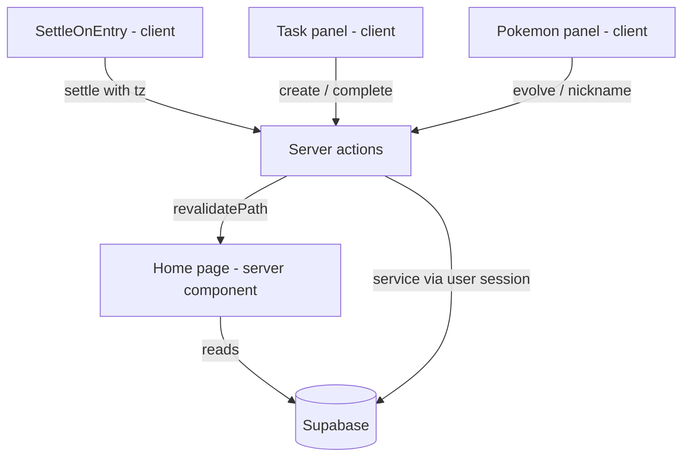

# Design: Poke Tracker

**Status:** Draft · **Author:** Dante Barr · **Date:** 2026-08-06
**Requirements:** [Project-Description.md](./Project-Description.md), refined over five grilling rounds · vocabulary in [CONTEXT.md](../CONTEXT.md)

## Summary

A gamified task tracker on Next.js/Vercel that replaces jarvis-hud and takes over its Supabase database. Tasks gain a **size** (1/2/3 effort points); each day's points are compared against a daily target, and the resulting **delta** drives an assigned Pokémon's happiness and bond level.

The core design problem is that the game is time-driven but nothing runs while the app is closed. The answer is a **replay-based settlement pass**: an append-only `day_ledger` records every finished day, and on app entry a server action settles each unsettled day one at a time, oldest first, until it reaches today. Today is never in the ledger — it is always derived live by summing tasks completed today.

The main tradeoff accepted: **Done is final** — a completed task can't be un-ticked or deleted. That single rule is what lets today's score be derived rather than counted, and keeps the ledger and the task list from ever disagreeing.

## Requirements

| ID | Requirement | Source | Addressed by |
|----|-------------|--------|--------------|
| R1 | Tasks carry a required due date, label, and size; label is per-trainer | PD, R2/R10 | §Data model |
| R2 | Everything jarvis-hud displayed carries over except `in_progress` | R2 | §Data model, §Component port |
| R3 | Completing a task earns 1/2/3 points by size | PD | §Control flow |
| R4 | Daily target is trainer-configurable, minimum 1 | PD, Q29 | §Data model |
| R5 | Delta ≥ 0 raises happiness and bond; delta < 0 lowers happiness only | PD | §Settlement |
| R6 | Happiness moves by the full delta, uncapped, and resets to 0 on leaving | Q12 | §Settlement |
| R7 | Bond belongs to the instance and never falls | Q12 | §Data model, §Settlement |
| R8 | Happiness < 0 → Pokémon leaves; replacement arrives the day after a good day, carrying that day's delta | Q12, Q26 | §Settlement |
| R9 | Days are calendar days in the trainer's device timezone, settled one at a time | Q6, Q26 | §Settlement |
| R10 | Settled days are immutable | Q13 | §State and lifecycle |
| R11 | Done is terminal — no un-complete, no delete | Q21, Q28 | §Interfaces, §Failure modes |
| R12 | Pool is fixed at signup: one instance per evolutionary line, three for Eevee (80 total) | Q23 | §Data model, §Migration and rollout |
| R13 | Bond requirements are cumulative per line; each step is its levels ÷ 4 clamped 2–7; 7 for stone/friendship/final | Q22 | §Reference data |
| R14 | Evolution is trainer-triggered, never automatic, and can chain | Q22, Q29 | §Interfaces |
| R15 | A Pokédex entry unlocks only while being that species *and* meeting its requirement | Q29 | §Control flow |
| R16 | Branching choices exclude forms already in the pool or already in the Pokédex | Q23 | §Interfaces |
| R17 | Multi-trainer capable: `user_id` on everything, Google OAuth with an allow-list | Q3, Q15 | §Data model, §Security |
| R18 | Three screens: Home, Settings, Pokédex; one light theme; mobile stacks sprite-first | PD, Q27 | §Architecture |
| R19 | Game starts clean — the 38 historical completions are not replayed | Q27 | §Migration |

## Current state

This is greenfield code against a **live database**. There is no existing Poke Tracker source; what exists is:

**The database** — Supabase project `Task Tracker` (`cdueipcuyfqqwlgjgykd`), one table `public.tasks`, 56 rows dated 2026-07-23 → 2026-08-06. RLS is enabled with permissive `anon` policies for all four operations. Verified state: zero null `due_date`, zero null `project`, zero labels outside Personal/Babylon/EA/Atlas, zero `in_progress` rows, 38 done rows all carrying `completed_at`, 25 rows with `source='email'`.

**jarvis-hud** (`gitlab.com/Infernite/jarvis-hud`) — the outgoing UI. Vite + React 19 + Tailwind v4, client-only, calling Supabase directly from the browser. Its `src/lib/dates.ts` (bucketing, humanising, done-by-day grouping) and its three components are the starting point for this app's task panel.

**What makes it non-trivial:**

1. **The game state is path-dependent.** Happiness depends on the *order* days are applied, and a Pokémon leaving resets it mid-sequence. Settling fourteen missed days as one aggregate gives a different — wrong — answer than settling them individually.
2. **Nothing runs while the app is closed.** All time-based state has to be reconstructed on demand, and must be idempotent: logging in twice must not settle a day twice.
3. **A second writer must be switched off first.** Jarvis (the Obsidian brief agent) still writes to `tasks` daily. Its write path must be disabled before `NOT NULL` constraints land, or its next insert fails. This is a manual step outside this repo.
4. **jarvis-hud's ADR-0002 is inverted by this change.** It argues at length for keeping the invariant *out* of the database. Its premise — an uncontrolled second writer — disappears here.

## Proposed design

### Architecture

Next.js App Router on Vercel. Server components read; server actions write. The browser never talks to Supabase directly.



Three routes: `/` (home), `/settings`, `/pokedex`. Home is a three-panel grid — stats and task creation left, sprite centre, task list right — collapsing to a single stacked column, sprite first, below the `md` breakpoint.

### Data model

New and changed tables. All carry `user_id` with RLS keyed on `auth.uid()`.

**`tasks`** (existing, altered)

| Column | Change |
|---|---|
| `user_id uuid not null` | **new**, FK `auth.users`, backfilled |
| `size text not null` | **new**, check `small\|medium\|large`, backfilled to `small` |
| `label_id uuid not null` | **new**, FK `labels`; replaces the freeform `project` text column |
| `completed_with_instance_id uuid null` | **new**, FK `instances` — who was with you when you finished it |
| `status` | check narrowed to `open\|done`; existing `not_started` rows become `open` |
| `due_date`, `size`, `label_id` | **`NOT NULL`** — the invariant moves into the database |
| `project` | dropped after backfill into `labels` |
| `source`, `source_ref` | kept as history, removed from the UI |

**`trainers`** — one row per `auth.users`, holding only what is per-trainer *and now*.

| Column | Type | Notes |
|---|---|---|
| `user_id` | `uuid` pk | FK `auth.users` |
| `daily_target` | `int not null default 3` | check `>= 1` |
| `happiness` | `int not null default 0` | belongs to the trainer, not the Pokémon |
| `active_instance_id` | `uuid null` | null means no Pokémon |
| `last_settled_on` | `date null` | the last day written to the ledger |
| `timezone` | `text not null` | last-known IANA zone from the browser |

**`labels`** — `id`, `user_id`, `name`, `color` (hex), `position`. Unique on `(user_id, lower(name))`. Colour is **data, not a Tailwind class** — per-trainer labels can't use the literal class strings jarvis-hud's `labels.ts` relies on.

**`species`** — static reference, 151 rows, identical for everyone: `id` (dex number), `name`, `sprite_path`, `evolves_from_species_id`, `bond_requirement` (cumulative, precomputed). Children are `species where evolves_from_species_id = X`, which gives branching for free without a join table.

**`instances`** — the pool. `id`, `user_id`, `line_id` (base species of the line, identifying the pool slot), `branch_index` (0–2, only Eevee uses >0), `species_id` (current form), `bond_level`, `nickname`. Unique on `(user_id, line_id, branch_index)`. **80 rows created per trainer at signup** and never added to or removed from.

**`pokedex_entries`** — `(user_id, species_id)` pk, `unlocked_on`. Stored, not derived: it depends on which species an instance *was* at the time, which the current state doesn't record.

**`day_ledger`** — append-only, unique on `(user_id, day)`.

| Column | Notes |
|---|---|
| `day` | date, in the trainer's zone at settlement time |
| `points_earned` | sum of completed task sizes that day |
| `daily_target` | the target **as it was that day** — this is why the ledger exists |
| `delta` | `points_earned - daily_target` |
| `happiness_after` | resulting happiness |
| `active_instance_id` | who was active during that day, nullable |
| `bond_awarded`, `pokemon_left` | what the day did |

### Interfaces

Server actions, all scoped to the caller:

```
settle(timezone: string) -> TrainerState
createTask(input: NewTask) -> void          // size, due_date, label_id all required
updateTask(id, patch: TaskEdit) -> void     // open tasks only
completeTask(id) -> void                    // one-way; stamps completed_with_instance_id
deleteTask(id) -> void                      // open tasks only; rejects done
setDailyTarget(n: int) -> void              // rejects < 1
createLabel / updateLabel / deleteLabel
evolve(instanceId, toSpeciesId) -> void
setNickname(instanceId, name) -> void
```

`evolve` guards: the instance's `bond_level` must be ≥ its **current** species' `bond_requirement`; `toSpeciesId` must be a child of the current species; and for a branching choice, the target must not already be the current species of any of the trainer's instances, nor present in their `pokedex_entries` (R16). The Pokédex check is redundant in Gen 1 but load-bearing if later generations add evolutions past a branch.

### Control flow

**Completing a task** — set `status='done'`, `completed_at=now()`, `completed_with_instance_id = trainer.active_instance_id` (null if none). No ledger write; today isn't in the ledger.

**Unlocking a Pokédex entry** — checked at exactly two moments: after a bond increment during settlement, and immediately after an evolve. The condition is the same both times: the instance *is* species S and `bond_level >= S.bond_requirement`.

### Settlement

The heart of the design. `settle(tz)` runs in one transaction:

```
today   := current date in tz
cursor  := trainer.last_settled_on + 1 day   (or the trainer's signup date on first run)
pending := null                              // delta of a qualifying day, awaiting arrival

while cursor < today:
    if pending is not null:
        instance := random instance from the trainer's 80
        trainer.active_instance := instance
        trainer.happiness := pending          // arrives carrying the qualifying day's delta
        pending := null

    points := sum(size points of tasks completed on `cursor` in tz)
    delta  := points - trainer.daily_target

    if trainer.active_instance is not null:
        trainer.happiness += delta
        if delta >= 0:
            instance.bond_level += 1
            maybe unlock Pokédex entry
        if trainer.happiness < 0:
            trainer.active_instance := null    // it leaves
            trainer.happiness := 0
    else if delta >= 0:
        pending := delta                       // arrival lands on the next day

    write day_ledger row for `cursor`
    cursor += 1 day

trainer.last_settled_on := today - 1 day
```

Properties this gives:

- **Idempotent.** Driven by `last_settled_on` with a unique constraint on `(user_id, day)` as a backstop. Settling twice in a day is a no-op.
- **Order-preserving.** A fourteen-day absence loses a Pokémon on the day happiness goes negative, not at the end.
- **An absence can never win you a Pokémon.** Absent days earn zero points, and `daily_target >= 1`, so every backfilled day has `delta < 0`. Arrival requires actually completing work — which requires logging in.
- **Bond and leaving can't collide.** Bond only rises when `delta >= 0`; leaving only happens when `delta < 0`.

### State and lifecycle

| State | Where | Lifetime |
|---|---|---|
| Today's points | **derived**, summed from tasks on every read | Until midnight in the trainer's zone |
| Finished days | `day_ledger` | Permanent, immutable |
| Happiness | `trainers.happiness` | Reset to 0 whenever a Pokémon leaves |
| Bond | `instances.bond_level` | Permanent, monotonically increasing |
| Pool | `instances` | Fixed at signup, 80 rows, forever |
| Species/sprites | `species` + committed files | Static; regenerated only by rerunning the generator |

### Reference data

A committed script hits PokéAPI once and emits a seed file plus sprite assets; the app never calls PokéAPI at runtime. Gen 1 is exactly evolution chains 1–78 (verified: chain 78 is Mew, 79 is Chikorita), which is where the 80 figure comes from — 78 lines, with Eevee's line contributing three instances instead of one.

`bond_requirement` is precomputed per species by walking each chain from its base: each step adds `(that step's level − the previous step's level) ÷ 4`, clamped to 2–7, and steps that aren't level-based — stones, friendship, trade — plus final forms contribute 7. Charmander 4 → Charmeleon 9 → Charizard 16.

### Component port

From jarvis-hud, largely intact: `dates.ts` (`bucketOpenTasks`, `groupDoneByDay`, `humanizeDueDate`), `TaskRow`, `AddTask`, `LabelChip`, `LabelSelect`.

Changed on arrival: the 3-segment status control becomes a one-way checkbox; `labels.ts` becomes a database read with hex colours instead of literal Tailwind classes; the `--spacing-actions: 20rem` fixed actions column and `max-w-[760px]` single-column shell are dropped, since the list is now a narrow right-hand panel; the `Unlabelled` chip and `"No date"` fallback are deleted as unreachable under the new `NOT NULL` constraints; and the `@theme` token block is relit for one warm off-white light theme, keeping jarvis-hud's discipline of reserving red/amber for urgency and one hue for interactivity.

## Alternatives considered

| Approach | Why it lost |
|---|---|
| **Aggregate settlement** — sum a whole absence and apply one delta | Destroys path dependency. Fourteen days at −2 then one at +30 nets positive, but the Pokémon should have left on day one |
| **Today gets a ledger row**, updated as tasks complete | A second source of truth for a number already derivable from tasks. Only needed if done tasks could be deleted — which they can't |
| **No ledger; derive everything from tasks** | Breaks the moment `daily_target` changes: past days would be re-judged against today's bar |
| **Invariant in TypeScript** (jarvis-hud's ADR-0002) | Its premise was an uncontrolled second writer. Jarvis's write path is being retired, so the database can finally hold the guarantee |
| **Allow un-complete / delete on done tasks** | Forces today's score to be a stored counter that survives deletion. One rule (Done is final) replaces a whole bookkeeping mechanism |
| **Lazy instance creation** | Makes the branching-exclusion rule inspect instances that may not exist yet. 80 rows per trainer is cheaper than the special case |
| **Settlement in middleware / nightly cron** | Middleware can't see the browser timezone and fires on every navigation; cron contradicts lazy reload and can't pick an hour that suits every zone |
| **Revoke table grants, write only via service role** | Correctly identified as over-engineering — this is single-player, and a trainer forging their own bond level harms nobody |
| **Runtime PokéAPI calls** | 151 immutable species is a build-time problem. Adds a third-party dependency to every page load for data that never changes |

## Failure modes and edge cases

| Case | Behaviour |
|---|---|
| Two tabs call `settle` at once | One transaction wins; `unique(user_id, day)` rejects the loser's duplicate rows and it retries into a no-op |
| `settle` called twice in a day | No-op — `cursor` starts at `last_settled_on + 1`, which is already `today` |
| Trainer travels east, "today" moves backwards | `cursor` never rewinds; if `today <= last_settled_on`, settlement does nothing. A day is never re-judged |
| Task completed at 23:59 local | Counted against that local day, since day keys come from `completed_at` converted to the trainer's zone |
| 200-day absence | 200 loop iterations in one transaction. Bounded and fast; the Pokémon leaves early in the run and no arrival is possible (all deltas negative) |
| Double-click on Evolve | Chaining is *legal*, so a second call could evolve again unintentionally. `evolve` takes the expected current `species_id` and rejects a mismatch |
| Branching choice with no legal options | Impossible in Gen 1 (three Eevee instances, three forms), but the action returns an explicit error rather than an empty picker |
| Deleting a label that still has tasks | Blocked by the FK — see Open questions for the intended UX |
| Sprite file missing for a species | Falls back to a silhouette placeholder; the generator script fails loudly if any of the 151 is missing |
| Sign-in by a non-allow-listed Google account | Rejected at the callback; no `trainers` row is created |

## Migration and rollout

Migrations live in `supabase/migrations/` and are applied with the Supabase CLI. Order matters — the backfill has to run before the constraints.

1. **Manual, first, outside this repo:** disable Jarvis's write path to `tasks`. Every later step assumes no other writer.
2. Create `trainers`, `labels`, `species`, `instances`, `pokedex_entries`, `day_ledger`.
3. Seed `species` (151 rows) from the generated file.
4. Create the `auth.users` row for the single trainer via Google sign-in, then its `trainers` row, its four labels (Personal, Babylon, EA, Atlas), and its 80 instances.
5. Alter `tasks`: add `user_id`, `size`, `label_id`, `completed_with_instance_id`; backfill `user_id` to the trainer, `size='small'` for all 56 rows, `label_id` by matching `project` to the four labels; migrate `status='not_started'` → `'open'`.
6. Apply constraints: `NOT NULL` on `user_id`, `due_date`, `size`, `label_id`; narrow the `status` check to `open|done`; drop `project`.
7. Replace the permissive `anon` policies with `auth.uid()`-scoped RLS on every table.

**Clean start (R19)** is achieved by setting `last_settled_on = signup date` when the trainer row is created. The settlement cursor therefore begins the *day after* launch, and the 38 historical completions stay task history without ever entering the ledger.

**Rollback:** steps 2–7 are reversible until step 6 drops `project`. Take a snapshot before step 5.

## Security and privacy

Supabase Auth with the Google provider. Sign-in is gated by an allow-list checked at the callback; a rejected account gets no `trainers` row and therefore no data. RLS on every table keys on `auth.uid()`, so a trainer can only ever read or write their own rows — enforced by the database, not by remembering to filter in application code. Server actions run with the caller's session rather than a service-role key, so there is no credential that could bypass RLS if leaked. The only personal data held is a Google account identity and the task text itself. Sprites and species data are public and non-sensitive.

## Testing strategy

jarvis-hud had no test suite. This app needs one, but only in one place: **settlement is the whole risk surface.**

The settlement loop is written as a **pure function** — `(startState, tasksByDay, target) -> (endState, ledgerRows[])` — with all database access outside it. That makes the interesting cases testable without a database:

| Case | What it catches |
|---|---|
| Fourteen absent days | Pokémon leaves on the correct day, not at the end |
| Leave → good day → arrival | Arrival lands the *day after*, carrying that day's delta |
| Absence containing a would-be good day | Confirms an absence can never produce a Pokémon |
| Settle twice | Idempotency |
| Delta exactly 0 | Counts as a good day (bond +1) — the boundary the rules turn on |
| Bond 14 Charmander, evolve twice | Charmeleon entry unlocks, Charizard entry does **not** |
| Task completed 23:59 vs 00:01 local | Day-boundary attribution |

Hard to test: anything timezone-dependent needs the clock and zone injected rather than read from the environment.

## Implementation plan

### Phase 1: Foundation
- [ ] Next.js App Router app scaffolded, deployed to Vercel
- [ ] Supabase Auth with Google + allow-list; a rejected account cannot sign in
- [ ] Migrations 2–7 applied; the 56 rows survive with `size='small'` and correct labels
- [ ] Done when: you can sign in, and `select` on `tasks` as another user returns zero rows

### Phase 2: Reference data
- [ ] Generator script hits PokéAPI once, emits the species seed + 151 sprites
- [ ] `bond_requirement` precomputed and spot-checked: Charmander 4, Charmeleon 9, Charizard 16
- [ ] Done when: `species` has 151 rows and a trainer's `instances` has exactly 80

### Phase 3: Task panel
- [ ] Port `dates.ts`, `TaskRow`, `AddTask`, `LabelChip`, `LabelSelect`
- [ ] CRUD via server actions; size required on create; complete is one-way; delete rejects done
- [ ] Buckets and done-grouped-by-day render against real data
- [ ] Done when: the existing 56 tasks read correctly and a new task can be created and completed

### Phase 4: Settlement engine
- [ ] Pure settlement function + the test table above
- [ ] `settle(timezone)` server action, transactional, called once on app entry
- [ ] Done when: manually backdating `last_settled_on` by 14 days produces the correct ledger and loses the Pokémon on the right day

### Phase 5: Pokémon panel
- [ ] Sprite, nickname, bond, happiness, today's effort against target
- [ ] Evolve button gated on bond requirement; branching picker with exclusions
- [ ] Done when: an instance can be evolved and its Pokédex entry unlocks at the right moment

### Phase 6: Remaining screens and theme
- [ ] Settings (daily target ≥ 1, label management) and Pokédex (unlocked entries of the 151)
- [ ] Light theme tokens, three-panel home, mobile stacking sprite-first
- [ ] Done when: the app is usable at 390px

### Phase 7: Cutover
- [ ] jarvis-hud container stopped and the repo archived

## Risks

| Risk | Early signal |
|---|---|
| **The signup Pokémon has no buffer.** It arrives at happiness 0, so a single missed day ends it — the exact problem later arrivals avoid by carrying a delta | Your first Pokémon leaves within the first week |
| **Uncapped happiness cuts the other way.** One enormous day can bank a month of immunity, making neglect consequence-free for weeks | A Pokémon survives a long stretch of visibly bad days |
| **Done being final is friction, not discipline.** A mis-tick is permanent and unfixable | You find yourself wanting an undo within the first fortnight |
| **Timezone travel** produces a day that is skipped or double-length | Ledger gaps after a trip |
| **PokéAPI evolution data is irregular** — trade and stone evolutions don't carry a `min_level` | The generator's clamp silently produces 7 for species you'd expect to differ |

## Open questions

1. **What labels does a *new* trainer get seeded with?** Yours are backfilled from the existing data, but Personal/Babylon/EA/Atlas is your vocabulary — a second trainer needs a generic default set, or an empty list plus a prompt.
2. **What should deleting a label with tasks attached do?** Block it, or reassign those tasks to another label first? The FK currently blocks.
3. **What is the default `daily_target`?** The schema assumes `3` as a placeholder — one Medium task, or three Smalls, per day.
4. **On timezone travel, does a day follow the device or freeze?** Currently it follows the device and the cursor simply never rewinds, which can produce a short or long day around a flight.
5. **When is the nickname prompted?** On arrival as a blocking modal, or an optional edit on the Pokémon panel afterwards.

